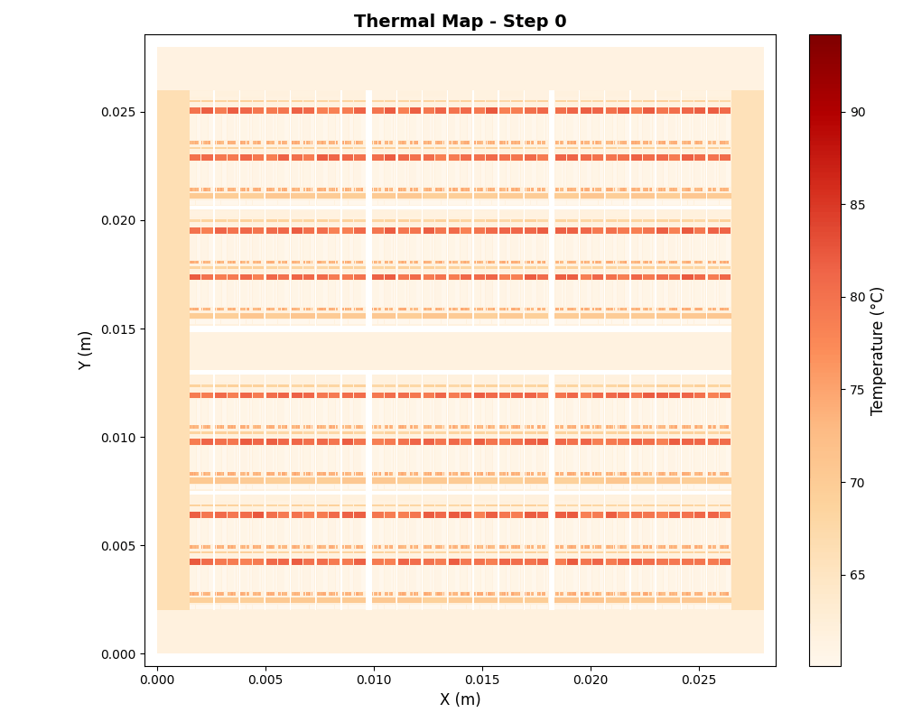

# PySpot
This repository reimplements
[HotSpot7.0's](https://github.com/uvahotspot/HotSpot) block model for
thermally modeling architectures, based on floorplans and chip specifications in Python with a custom implementation of backwards-euler and matrix system solvers (mainly: Numpy's default, GMRES, LU, and QR).

## Depdenencies
You can install all Python dependencies via `python3 -m pip install -r
requirements.txt`. The main packages you need are:
- pandas
- numpy
- matplotlib (for graphing scripts)

## Running
You can run PySpot as such:
`pyspot.py -f FLOORPLAN -p PTRACE -c CONFIG [-ss] [-ms {numpy,GMRES,LU,QR}]
[--output OUTPUT]`

You must provide a floorplan, power trace, and config file (the arguments
`-f`, `-p`, and `-c` respectively) at minimum. You can optionally specify if
you want to perform steady-state (looking at the worst-case temperature)
analysis via `-ss` and the matrix solver algorithm via `-ms`.

## Directory Structure
The repo is divided into several directories:
- `pyspot/`: Contains the main source for the thermal model.
- `examples/`: Contains several examples for floorplans to model. Right now,
  this only contains examples for an EV6 processor and for an NVIDIA V100. The
V100 has a floorplan that is *roughly* based on the block model from [here](https://cvw.cac.cornell.edu/gpu-architecture/gpu-example-tesla-v100/GV100FullChipDiagram25pct.png)
- `scripts/`: Contains helper scripts to generate "mock" power traces for the   V100 floorplan, graph a heatmap based on a floorplan and thermal trace, and
benchmark each of the matrix solvers found in `pyspot/hotspot_solver/hotspot_matrix_solver.py`.
- `prelim-results/`: Contains examples of some results collected by me using
  multiple solvers and floorplans.

## Example Results
The following below is thermally modeling a V100 using GMRES using a mock
power trace!

## LLM Disclaimer
The majority of this repo is my own work, however I used an LLM for assisting
with the graphing script in `scripts/hot-graphs.py`, obtaining mock power
results for the V100 in `examples/v100/generate-gpu-power-traces.py`, and for
assisting in the V100 floorplan/config.
